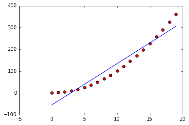
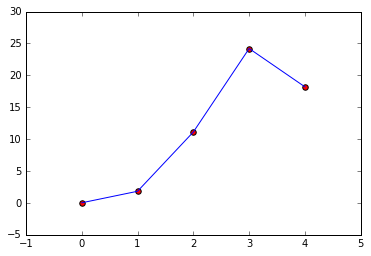
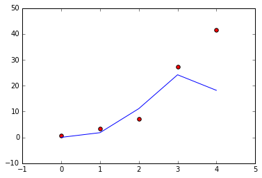
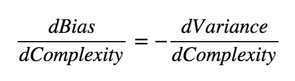
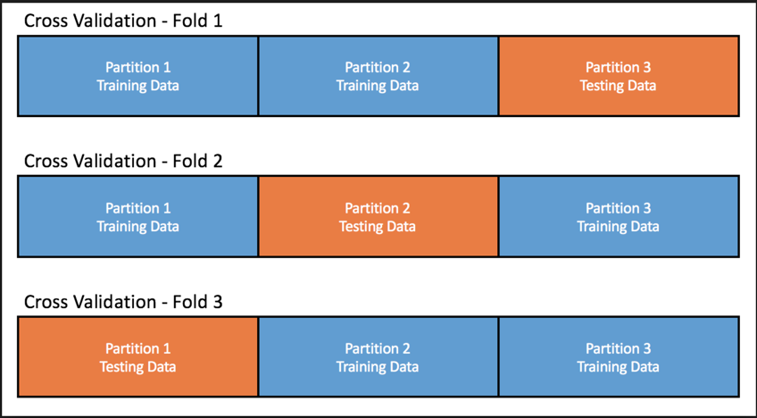

# Cross-Validation

By the end of this lecture, you will be able to:

- Identify what the `bias versus variance` tradeoff, overfitting, and underfitting are
- Explain why cross-validation is a necessary part of model generation
- Use appropriately and explain the difference between:
  - [`sklearn.model_selection.train_test_split`](http://scikit-learn.org/stable/modules/generated/sklearn.model_selection.train_test_split.html#sklearn.model_selection.train_test_split)
  - [`sklearn.model_selection.cross_val_score`](http://scikit-learn.org/stable/modules/generated/sklearn.model_selection.cross_val_score.html#sklearn.model_selection.cross_val_score)
  - [`sklearn.model_selection.cross_val_predict`](http://scikit-learn.org/stable/modules/generated/sklearn.model_selection.cross_val_predict.html#sklearn.model_selection.cross_val_predict)
  - [`sklearn.model_selection.KFold`](http://scikit-learn.org/stable/modules/generated/sklearn.model_selection.KFold.html#sklearn.model_selection.KFold)

## Bias versus Variance Tradeoff, Overfitting and Underfitting

When we have made a model, we will want to judge how well it predicts data. One metric to do so is to look at the degree of _error_:

> *_Error_*: the degree to which a model's predictions diverge from a known actual value.

For a linear regression, we will use the sum of squared errors (or SSE) to judge the error in our model. SSE is calculated by taking the difference between the actual value for our outcome variable and the value that our model predicted. We square that difference (so that each difference is positive) and sum them together. 

SSE is not a directly interpretable value, but generally bigger values (within the same set of data) mean that version of a model has larger errors.

### Bias

Conceptually, we will think about different reasons why our SSE is large or small, specifically this is because of _bias_ and _variance_ in the model. 

> Bias: a model has if it makes assumptions about what the data *should* look like and misses the mark. 

For example, a model that predicts a straight line is not a good approximation for a set of data that is actually a parabola:



In this case our model has an opinion about the shape of the data that's not quite right, so we say it is biased. Adding more data or sampling different data will not make the model more effective. 

Usually there is a sweet spot where:
  - the bias is low 
  - the model is *appropriately* complex 

It may seem tempting to use a high degree polynomial with lots of parameters to find a low bias model, and that's somewhat true. 

The unnecessary parameters will have values close to zero and our model will generally have low bias if the data is polynomial in nature. However, there is another source of error from using models with many parameters.

### Variance

Since our data has inherent errors, small fluctuations in the data can introduce artifacts that our model will attempt to fit. If we have a lot of parameters, we may end up fitting a model that doesn't fit the data, or doesn't well fit another sample of data from the same source. 

> Variance: a model that has mistaken unique or weird parts of the dataset for broader, predictive trends

For example, with the following data points we could try to fit a line to a higher dimensional polynomial:



**For the data that the model has already seen**, the model fits nearly perfectly. However, if we take new data from the same source and repeat the fit:



The model does not fit the second sample well even though they are from the same source. This source of error is known as _variance_ -- our model predicts data that it has seen before very well but data that it has not seen very poorly.

- [Visualization on Bias and Variance](http://scott.fortmann-roe.com/docs/BiasVariance.html)

**Check for Understanding**: Discuss with a partner or small group
- Is bias preferable to variance? Vice versa? Why or why not?
- Work as a group to create a fake or pretend model (pick a feature to predict and some features that you might use to predict that). How would you know if that model had a high bais / what would those results look like? What if the model had a high variance?

### The Tradeoff

There is a third source of error, which is the error inherent in our model. This is just the inherent inaccuracy present in all data (misspecification, different ways of specifying data, inherent instability, what have you). Essentially, it's error that exists no matter how we specify our model. 

Given that there is some unavoidable error with every model, we often talk about a "tradeoff" between bias and variance.

We can imagine that trade off mathematically:



where we say that for a small change in the complexity of the model, there's an inverse (and equal) change between the bias and the variance. We can also imagine this visually as well:


In other words, we can imagine a model as having some range of complexity, from completely simple to using every single possible variation of every feature in the model. As we move back and forth across this range of complexity, as our model **becomes more complex**, variance goes up and bias goes down and as our model **becomes more simple**, bias goes up and variance goes down.

_However_, there is an ideal complexity for a model where the bias and the variance are as small as possible.

## Overfitting and Underfitting

Rather than say that a model has high variance and low bias (or vice versa), we typically refer to models as overfit or underfit. A good visual example of the same data having an underfit, an overfit, or a properly fit model follows:


(from [Tom Robert Shaw -- Intro to Machine Learning](http://tomrobertshaw.net/img/2015/12/overfitting.jpg))

**Check for Understanding**: In groups, answer the following:
1. Define "underfitting", "overfitting", and "model complexity" in your own words. How do they relate to bias and variance? 
2. What is wrong with the "underfit" and "overfit" models in the pictures above?
3. Is there a "sweet spot" between being underfit and overfit? Would that relate to the complexity of a model and if so, how?
4. Think back to the [Titanic Data Set](https://www.kaggle.com/c/titanic). Discuss what the differences and similarities would be between the three following models. In particular, try and identify features and different transformations (such as dummy variables, etc.) that might feature in each. 
    - An underfit model to predict surviving the Titanic
    - An overfit model to predict surviving the Titanic
    - A model that was neither over- nor underfit to predict surviving the Titanic

## How do we know?

We cannot easily determine _why_ our model is wrong. Our model may be overfit or underfit, but just by looking at it, it is hard to tell. 

In practice, **we will use data that the model has never been exposed to (but that we know the "true" response of) to judge how well (or unwell) our model fits**. 

To help our discussion, let's define a few key points here:

> **Model**: the features, model type (linear regression, etc.), and hyperparameters used to estimate parameters to predict an outcome. We can take the same features, model type, and hyperparameters and "fit" it to more or less of the same data to get (in essence) more or less precise parameters.

> **Parameter**: the estimated influence or impact of a feature. This is a function of the features in the model, the type of model, the hyperparameters used, and the data fed into the model.

> **Feature**: A set of data used for prediction (typically refering to one column in a dataset). Most models have multiple features.

> **Hyperparameter**: A part of the model that we modify as the researcher outside of what data and what features we use. We'll see this more when we start talking about regularization. 

> **Fitting a Model**: Using a specific set of data to estimate parameters for a model -- the same model may be fit to different sets of data (or different parts of the dataset) to estimate (usually slightly) different values. Additionally, many different models may be fit to the same set of data as well. Once a model is "fit", we can use it to predict either data that it has already seen before or to predict a value for a data point that it has never been exposed to.

Why would we use "new" data to estimate how well our model does? The reasoning is as follows:

1. At the end of the day, we want a model that performs well, so making sure that it is not underfit or overfit is important
2. We have a near-infinite number of things that we can change in our model to alter the predictive power
3. Because _a priori_ we have no idea whether our model is *too complex* or *not complex enough* and what a given change will do to that complexity, we should try many options
4. If we try to use how well our model performs on data used to fit it, we run the risk of choosing an overfit model (because we would not know if we are identifying good trends or trends that are unique to that specific set of data)
5. However, comparing different "forms" of the model trained on the same data to a set of data that each model has "never seen before" gives us a simulation of how that model will do when facing truly new data. 
6. The model that does the best on the "new" data is the one that we should refit to all available data.

**Check for Understanding**: With a partner or in a small group:
1. Define **Model**, **Parameter**, **Feature**, and **Fitting a Model** in your own words. 
2. Review the reasoning why 1) evaluating how well a model works using data that it has been fit to is not a good idea, and 2) evaluating how well a model works using data that it has not seen before is a good idea. 

## Train Test Split

As data scientists, we almost always also perform model validation by splitting our available data into subsets **before we begin modeling**: data that we *train* our model on, and data that we *test* our (now fit) model on.

The most basic type of model validation is called **train-test split**. In this process, we split our data into two pieces:

- **"Training set":** the subset of the data that we fit our model on.
- **"Testing set":** the subset of the data that we evaluate the quality of our fit model on.

Because we will be doing **all** of our training on the training set before we double-check our work on the test set, we will randomly select which rows go into each set. That should _a priori_ give us the expectation that the sets are comprable, except for the fact that we will not use the test set until we are finished modeling.

## K-Fold cross-validation

K-Fold cross-validation takes the idea of a single train-test split and expands this to *multiple tests* across different train-test splits of your data.

For example, if you determine your training set will contain 80% of the data and your testing set will contain the other 20%, you could have 5 different 80/20 splits where the test set in each is different sets of observations. We have:
- 5 (K=5) training sets each containing 80% of the data
- 5 (K=5) corresponding test sets containing the remaining 20% of the data

**K-Fold cross-validation builds K models, one for each train-test pair, and evaluates those models on each respective test-set.**

Note also that:
- The splits remain _the same_ across each set, it's just which fold (or portion) of the data set is held out for testing that changes across each set. 
- Every row shows up in only one fold (so each row will be in the training set 4 times and in the test set 1 time)
- While you can randomize which rows are in fold, typically we will just split them in order (the top 20% of the data will go into fold 1 for 5-fold CV, etc.)

### K-Fold cross-validation visually



**Check for Understanding**: In pairs or a small group, discuss the following:
1. In your own words, what is the difference between k-fold cross-validation and train-test split?
2. If you have a dataset with 1,000 rows:
    - How many rows will be in your training and test set after train-test split at 25%
    - How many rows will be in the training sets and test sets after 3-fold cross-validation
    - How many rows will be in the training sets and test sets after 5-fold cross-validation
3. Do we typically randomize the data during train-test split? Do we typically randomize during cross-validation? Why or why not? 

## Typical Workflow

1. **Split data into a large train and small test set. This small test set will be the "hold-out" set.**
2. **For a set of different model parameterizations:**
    1. **Set up the model.**
    2. **Cross-validate the current model on the training data.**
    3. **Save the model performance.**
3. **Select the model that performed best using cross-validation on the training data.**
4. **Perform a final test of that model on the original "hold-out" test set.**

## Train-test split and cross-validation in sklearn

In this section, we'll describe four different libraries that we will use to do train-test split and cross-validation in sklearn:

- [`sklearn.model_selection.train_test_split`](http://scikit-learn.org/stable/modules/generated/sklearn.model_selection.train_test_split.html#sklearn.model_selection.train_test_split): to create a training and test set for train-test split.
- [`sklearn.model_selection.cross_val_score`](http://scikit-learn.org/stable/modules/generated/sklearn.model_selection.cross_val_score.html#sklearn.model_selection.cross_val_score): to run cross-validation and return **just the scores for each test set**
- [`sklearn.model_selection.cross_val_predict`](http://scikit-learn.org/stable/modules/generated/sklearn.model_selection.cross_val_predict.html#sklearn.model_selection.cross_val_predict): to run cross-validation and return **just the predicted values for each row when it was in the test set**
- [`sklearn.model_selection.KFold`](http://scikit-learn.org/stable/modules/generated/sklearn.model_selection.KFold.html#sklearn.model_selection.KFold): to run cross-validation and return **the actual train and test folds themselves**

There are other options that make use of cross-validation (notably [`sklearn.model_selection.GridSearchCV`](http://scikit-learn.org/stable/modules/generated/sklearn.model_selection.GridSearchCV.html#sklearn.model_selection.GridSearchCV) and [`sklearn.model_selection.RandomizedSearchCV`](http://scikit-learn.org/stable/modules/generated/sklearn.model_selection.RandomizedSearchCV.html#sklearn.model_selection.RandomizedSearchCV)), but we will address these in a later lesson.

### `train_test_split()` 

Train test split using sklearn is easy. Load the `train_test_split()` function:

```python
from sklearn.model_selection import train_test_split
```

**Arguments**:
- *arrays: Any number of arrays/matrices to split up into training and testing (they should be the same length).
- `test_size`: an integer for exact size of the test subset or a float for a percentage
- `train_size`: alternatively you can specify the training size
- `stratify`: supply a vector to stratify the splitting by (more important in classification tasks)

**Perform a 50-50 split of a given `X` and `y`:**

```python
from sklearn.model_selection import train_test_split
X_train, X_test, y_train, y_test = train_test_split(X, y, test_size=0.5)
```

### Fit a linear regression on the training set

Using the training `X` and training `y`, we can fit a linear regression with sklearn's `LinearRegression`.

```python
from sklearn.linear_model import LinearRegression

slr = LinearRegression()
slr.fit(X_train, y_train)
```

### Calculate the r^2 score on the test data

After we have our model constructed on the training set, we can evaluate how well our model performs on data it has no exposure to.

```python
print(slr.score(X_test, y_test))
```

> **Note**: Do not **refit** `LinearRegression()` to the test set -- unless you are making a _new_ model you should only call `.fit()` once. `.score()` and `.predict()` will work with any new data provided that 1) your model has been fit already and 2) your test set has the same number of features (and the same order) as your training set.

**Compare this to the model scored on the training set -- you should see that the training set has a higher r^2 score**

```python
print(slr.score(X_train, y_train))
```

## K-Fold cross-validation demonstration

The function `cross_val_score` returns _whatever method is called when `.score()` is called_ for each test set -- for `LinearRegression()`, this is the R^2 score. 

Alternatively, the function `cross_val_predict` returns the predicted values for each data point when it is in the testing slice.

These functions are great for a really quick look at the model (and how it might perform when facing unknown data) -- they are _really_ limited, however. They are best used as a quick look but other methods usually work better for more intensive application.

### Useful Arguments (for both)

- `estimator`: a sklearn model object (like `LinearRegression()`) -- this is what `cross_val_score()` will use to fit and score the model
- `X` and `y`: the features and target that you are attempting to predict
- `cv`: the number of folds you want to make (the default is 3)
- `n_jobs`: number of cores on the CPU to use -- set to `-1` to use all

```python
from sklearn.cross_validation import cross_val_score, cross_val_predict
from sklearn import metrics

# Perform 5-fold cross validation
scores = cross_val_score(slr, X, y, cv=5)
print('Cross-validated scores:', scores)

# Make cross validated predictions on the test sets
predictions = cross_val_predict(slr, X, y, cv=5)
plt.scatter(y, predictions)

# manually calcualte the r2
r2 = metrics.r2_score(y, predictions)
print('Cross-Predicted R2:', r2)
```

## Review: negative r^2 values

What does it mean to have a negative r^2?

A negative r^2 only makes sense (and can only be found) when we are evaluating the r^2 score on data that the model was not fit on. If r^2 is evaluated for a model using the training data, *the minimum r^2 must be zero.* 

However, on a test set the r^2 **can** be negative. This means that the model performs so poorly on the testing set that you would have been better off just using the mean of the target from the training set as an estimate!

## `KFold`:

Scikit-learn also offers other options to manually split out _k_-folds, which can be very helpful if you're trying to find other metrics about each of the folds (as opposed to just what is built into `cross_val_predict` and `cross_val_score`).

There are two main flavors of manual k-folds, [KFold](http://scikit-learn.org/stable/modules/generated/sklearn.model_selection.KFold.html#sklearn.model_selection.KFold) and [StratifiedKFold](http://scikit-learn.org/stable/modules/generated/sklearn.model_selection.StratifiedKFold.html#sklearn.model_selection.StratifiedKFold). The difference here is that KFold sorts into different folds without considering the y variable where as StratifiedKFold will try and retain the same proportion of each class in y across each of the split (Note: this is really good if you have unbalanced data or classes that have small proportions, this is very _bad_ if you have a y variable that is continuous in nature).

The other point to mention is that by default, these iterators will not shuffle your data prior to splitting rows out. This could be problematic if your data has some inherent sorting, such as if you have data that is naturally in time-dependent order. This is an easy option to change if you require shuffled data.

```python
from sklearn.model_selection import KFold, StratifiedKFold
from sklearn.datasets import load_iris

iris = load_iris()

kfold = KFold(3)

counter = 0
for train_ix, test_ix in kfold.split(iris.data):
    print('Train Split {}'.format(counter), train_ix, '\nTest Split {}'.format(counter), test_ix, '\n')
    print(iris.data[train_ix][0:5],'\n\n', iris.data[test_ix][0:5],'\n')
    counter += 1

skfold = StratifiedKFold(3)

counter = 0
for train_ix, test_ix in skfold.split(iris.data, iris.target):
    print('Train Split {}'.format(counter), train_ix, '\nTest Split {}'.format(counter), test_ix, '\n')
    print(iris.data[train_ix][0:5],'\n\n', iris.data[test_ix][0:5],'\n')
    counter += 1
```

## Additional Resources

- [Cross-validation Example](http://scikit-learn.org/stable/auto_examples/exercises/plot_cv_diabetes.html#example-exercises-plot-cv-diabetes-py)
- [Plotting Cross-Validated Predictions](http://scikit-learn.org/stable/auto_examples/plot_cv_predict.html)
- Examine this [academic paper](http://frostiebek.free.fr/docs/Machine%20Learning/validation-1.pdf) on the underpinnings of the holdout method, LOOVC, and kfolds
- The sklearn [documentation](http://scikit-learn.org/stable/modules/cross_validation.html#cross-validation) on cross validation is strong
- This [Stanford lesson](https://www.youtube.com/watch?v=_2ij6eaaSl0) on cross validation
- This [blog post](http://www.win-vector.com/blog/2015/01/random-testtrain-split-is-not-always-enough/) on why TTS is not always enough
- StackExchange [discussion](http://stackoverflow.com/questions/13610074/is-there-a-rule-of-thumb-for-how-to-divide-a-dataset-into-training-and-validatio) on approximate TTS, validation set sizes